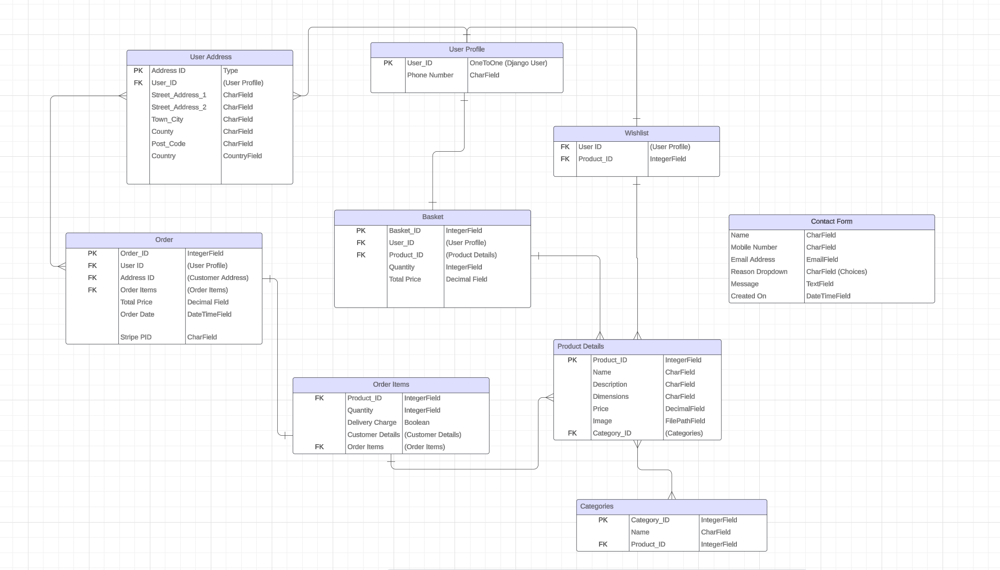

# Fine Furnishings
Fine Furnishings is a B2C focused online furniture store that will provide it's users a relaxing and trustworthy experience when purchasing new home furnishings. The goal of Fine Furnishings is to provide quality furniture to our customers as well as a seamless online experience that will provide them with peace of mind when purchasing from our company.

So many online experiences leave the user hesitating to make a purchase or stumbling through a website that is not user friendly. As we know how significant our surroundings and atmosphere are, our goal here, is to ensure that the user has easy accessibility to all the answers of any questions they may be asking when purchasing new furniture. If their question is not easily answered, we will provide an easy system of contact for the user to ask their specific question. 

Our goal is to provide simple navigation of the website so that our customers can purchase quality furniture from a trustworthy business.

# User Experience (UX)

## User Stories:
**Planning of user stories completed in Google sheets:
[Google sheet](https://docs.google.com/spreadsheets/d/1xrrFyjqHdzZsPyJ-DnGmsfV3z4rvsZ0ZD8F23ye3utk/edit#gid=0)

## ERD Diagram:
[LucidChart ERD](https://lucid.app/lucidchart/c013de76-fea2-4861-9c69-efccf9e6f6ca/edit?invitationId=inv_27c26c18-d566-4a6a-b26c-0b9be3d8465f&page=0_0#)

## Wireframes:

## Design:
- Using the color Red - psychology of color
- Muted colors for a more peaceful experience

## External links that will be found on the site:
- Blogs:
Home Furnishing Blog
Psychology of Design
Sustainable Furniture (Upcycling)

- Disposal & Upcycling information:
mywaste.ie
kollect.ie
wiseireland.ie

- Social Media:
Facebook (will create a Facebook page)
Instagram

- Reviews:
Trustpilot reviews

# Existing Features

## Future Features

# Testing

## Validator Testing:

## Manual Testing:

## Bugs/Unfixed Bugs:

# Deployment

## Steps taken to deploy on Heroku:

## Fork Repository

## Clone Repository

# Credits
- The Boutique Ado Walkthrough was referenced when setting up Django and Allauth

### Content

### Technologies Used
- Pexels.com (images)
- Unsplash.com (images)
- Adobe Express Converter (convert jpeg to png)
- compresspng.com (compress png)

### Media & Layout

## Acknowledgements
