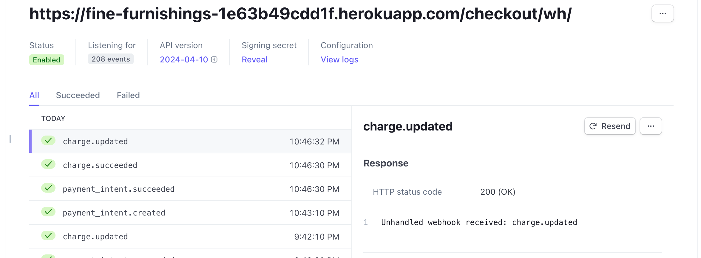
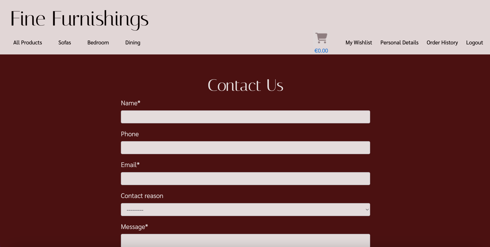

# Fine Furnishings

Fine Furnishings is a B2C focused online furniture store that will provide it's users a relaxing and trustworthy experience when purchasing new home furnishings. The goal of Fine Furnishings is to provide quality furniture to our customers as well as a seamless online experience that will provide them with peace of mind when purchasing from our company.

So many online experiences leave the user hesitating to make a purchase or stumbling through a website that is not user friendly. As we know how significant our surroundings and atmosphere are, our goal here, is to ensure that the user has easy accessibility to all the answers of any questions they may be asking when purchasing new furniture. If their question is not easily answered, we will provide an easy system of contact for the user to ask their specific question. 

Our goal is to provide simple navigation of the website so that our customers can purchase quality furniture from a trustworthy business.

# User Experience (UX)

## Project Planning

 User Stories

- Planning of user stories completed in Google sheets:
[Google sheet](https://docs.google.com/spreadsheets/d/1xrrFyjqHdzZsPyJ-DnGmsfV3z4rvsZ0ZD8F23ye3utk/edit#gid=0)
- Link to my [GitHub Project](https://github.com/users/morganoleary/projects/5)

ERD Diagram - Lucidchart

Wireframes - Justinmind

- The wireframes for this project were created on the Justinmind local development environment for MacOS. Due to the time constraints for completing this project, I did not have the time to implement all device sizes for each page's wireframes. The mockups for these pages were used as a guide for the project as I continued to style more and adjust the project during project creation and coding.

Design

- Using the color Red - psychology of color
I used the color Red as it has been proven to boost online sales. While the site has a red overall color, I created a more muted version to keep the site classy and more elegant for a more peaceful shopping experience. More information on this was found at [Crazy Egg](https://www.crazyegg.com/blog/colors-proven-to-boost-sales/).
- The content of the project was created by myself. I found the images and created the descriptions, pricing, etc. on all products. The content from the FAQs page is also created by me as an example of what I would like to see from a furniture store if I were the consumer.

## Marketing:

E-Commerce Business Model

- Fine Furnishings uses a business to consumer (B2C) business model. This is a furniture company that provides quality furniture to customers throughout the island of Ireland. The value of the company's services is huge as it provides a better well-being to everyone's day-to-day living within their homes. The business supplies furniture for consumers, customers are able to make purchases of the furniture on the Fine Furnishings website and the company is able to process orders via the website to complete each order placed.

SEO Implementations

- Descriptive meta tags & keywords were used throughout the site. In particular, the product descriptions and image file names. More keywords and meta tags will be used in future as the site content will bulk up about the business. 
- [sitemap.xml](https://www.xml-sitemaps.com/) was used to create and add the sitemap.xml file to the root directory.
- A robots.txt was added to the root directory of the project.

Facebook Screenshots

# Features

Existing Features

- Home page - this page was created to draw the users attention to a calm yet exciting color of site as well as an eye-catching image of the possibilities when shopping on this site.

- Home page product category blocks were added on the home page to allow users to navigate to specific furniture categories instead of using the navbar or search bar. This was first implemented with the idea that the home page will eventually contain much more content so that as the user scrolls through, they don't have the need of scrolling back to the top to search for products.

- Navbar - the navbar was designed for an easy user experience. On desktop and tablet, the text remains for easy navigation and on dropdown this shrinks to a hamburger menu with the same dropdown options. 

- User login/registration was implemented using Django AllAuth. These links can easily be found in the main navigation bar of the site on all pages.

- When a user logs in or registers a new account, the menu options change to provide the user with a link to their personal wishlist, their personal details and a logout option.

- User Wishlist - this page can only be accessed when a user is logged in. If a user tries to add a product to the wishlist, they are prompted to register an account or login. On this page, the user can either navigate into each product page to read more and add to their cart, or delete the item from their wishlist.

- User Personal Details - this page can only be accessed by a logged in user and autopopulates any saved details the user has previously added that is stored on the admin panel. From this page, the user has the option to edit their details and save or delete their account. 

- Edit personal details - this modal pop up gives the user the option to add a second delivery address to save to their account if they wish. The save button is found at the bottom of the modal **see in bugs section of readme - the multiple address function is not working 100% and while a user can enter a second address, this does not yet save correctly.

- Delete account - from the personal details page, the user is able to delete their account. A pop up modal is in place to have the user verify this action should be completed before proceeding with deletion.

- Product Search Bar - the search bar can be found on all product pages of the site and allows users to filter searches if the word is found in the name of the product or within the description. Further search criteria to be expanded in the future.

- Product Categories & Filtered pages - the navbar provides an "All Products" option to view all products on the page as well as the three main categories of "Sofas" "Bedroom" and "Dining" that provide dropdown menus to filter each category further to specific types of items. Users are able to add items to their wishlist from these product pages.

- Product Detail page for each product - each product contains the following details: Name, Image, option to add to wishlist, Price, Product ID, Quantity Selector, Add to Cart option, Description and Dimensions. Bedframes also have a Size selector option of 3', 4', 4'6", 5' and 6', as well as all sizes of dimensions listed.

- Shopping Cart page to view before purchasing - this page allows the user to view the products added to the basket and adjust items and quantities before continuing to checkout to purchase. Within the cart, the user is able to delete items from the cart as well as adjust quantities and see the price adjust with the changes.

- Secure Checkout page for the user to checkout with Stripe - the checkout page provides the user with an Order Summary of what they are about to purchase, a form to fill in any details - if not already suppled in the personal details page - and a card input to pay securely with Stripe's payment system. **see bugs for the incorrect layout on mobile screens, in future developments the order summary will be visible before checkout is possible.

- Order Confirmation - upon a successful purchase, the user is taken to an order confirmation page to show their order number and details. At this stage, the cart is emptied and the balance reverts to 0.

- FAQs page - this page can be found in the footer of the site and provides dropdown questions and answers for frequently asked questions the business is expecting a user to ask. This page also provides a link to the contact form page in case a user's question is not answered in the FAQs provided.

- Contact Us page - this page can be found in the footer of the site and can be accessed by both registered & unregistered users. The form requires fields to be field out before it can be submitted and provides a dropdown for the possible reasons a user may be sending a query to the business: General Queries, Return an Order, Complaints & Feedback.

- Footer links - the footer is visible on all pages of the site and provides links to the following: FAQs page, Contact Us page, Social medial links for Facebook & Instagram (opening in a separate window), two external site links and a newsletter signup form:

- Mailchimp Subscription form working to store contact emails on Mailchimp:

- A custom 404 page has been created - this page includes a link back to the home page OR to the contact form for the user to send any queries about why a certain page was not found.

#### External Links in Footer

- A link to [kollect.ie](https://kollect.ie/) can be found in the footer as many customers looking for new furniture will be in need of a service to dispose of their old furniture. Since Fine Furnishings does not offer these services, this provides our users with a simple solution to their disposal needs.
- A link can be found in the footer to the [Psychology of Design blog](https://blog.zeelproject.com/64-psychology-in-interior-design.html). Many consumers, looking to purchase furniture, would like help and assistance in making a decision for what suits their home and needs best. The customer can always contact the business with any questions, but this blog provides a simple read to give the customer some ideas of what they may be looking for.

## Future Implementations

Future Features

- In future features, the site's home page will contain a Google Map for the company's location. 
- In future features, an About Us page will be implemented to give the user more information about the company.
- In future developments, the user's order confirmation will be stored in the user's 'Order History' on their individual profile, and they will have access to this from the navbar when logged in. This was not implemented due to time constraints on project submission.
- In future developments of this project, I will implement Stripe Webhook handlers and email confirmations to give the user better feedback on their checkout system. This was not implemented due to time constraints.
- In future features, the site will have a section for company reviews to help showcase the company's reputation and drive new users to the site. This would be implemented with a link to a Trustpilot review page in the footer as well. 

# Testing

Validator Testing

Manual Testing

Bugs/Unfixed Bugs

- Success messages are showing after the user navigates to a new page on the site. The message should be appearing on the page the user remains on or is redirected to, if called for. This will be fixed/updated in future features and was unfixed due to time constraints.
- I wanted the user to be able to save multiple addresses to their user profile and select a specific address when placing an order. Maybe they save a 'Home' address, 'Office' address, etc. Unfortunately, I implemented the model correctly with the Address name and the form allows for a second address to be added, however in future fixes, this will work correctly as any added addresses are not saved to the profile or admin panel. This was not fixed due to time constraints with submission.
- The search bar works as it should, however I noticed that a user is unable to search for the multiple description of an item such as 'tables' or 'sofas' and only the singular works. In future implementations I will learn more on how to expand the search criteria.
- On mobile screens, the search bar remains in place when the hamburger menu is expanded. This should be hidden behind the menu on mobile devices. 
- There are some styling issues between device sizes that have not been fixed as I ran out of time for submission. 
- On the checkout page, the Stripe card input is not styled correctly and I struggled to find a solution as I did not want the background to be the dark red but a card instead to match the rest of the form fields. This will be fixed in future developments.
- On the checkout page, the order summary is below the payment input on mobile screens. In future, the order summary will come before the user can submit a payment. 

# Deployment

Steps taken to deploy on Heroku

Set up the workspace:
1. Install gunicorn in workspace for Heroku deployment
2. Add to requirements.txt and create Procfile
3. In settings.py set DEBUG = False 
4. Reconfigured Default file & Static file storage in settings.py to allow Cloudinary deployment with Heroku
5. Added the Heroku app to the 'Allowed Hosts' in settings.py
6. Ensured all secret keys were added to the env.py file & stored in the gitignore file
7. Git add, commit and push changes to GitHub
Deploy on Heroku:
8. Create the app on Heroku and connect to GitHub project
9. Set the Config Vars in the "Settings" Tab - this includes: CLOUDINARY_API_KEY, CLOUDINARY_API_SECRET, CLOUDINARY_CLOUD_NAME, DATABASE_URL, SECRET_KEY, STRIPE_PUBLIC_KEY, STRIPE_SECRET_KEY
10. Navigate to the "Deploy" tab and scroll down to click on "Deploy Branch" in the "Manual deploy" section

Fork Repository

Forking a repository allows you to create a copy to GitHub, and any changes made will not affect the original repository:

- Within GitHub, navigate to the repository page you are going to fork
- Click "Fork" on the top right corner of the page
- Wait for the copy to be created and you are then redirected to the forked repository

Clone Repository

Cloning a repository allows you to create a local copy of a repository on your machine:

- Within GitHub, navigate to the repository you are wanting to clone
- Click the green "<>Code" button
- Within the "Local" tab, copy the HTTPS url
- In your IDE, open Git Bash and type in 'git clone' followed by the pasted url just copied from GitHub. Ex: git clone https://example.com/repository/project
- The clone has been created on your local machine

# Credits

Content

- The Boutique Ado Walkthrough was referenced when setting up Django, Allauth and the base template.
- The [Boutique Ado Walkthrough](https://learn.codeinstitute.net/courses/course-v1:CodeInstitute+EA101+2/courseware/eb05f06e62c64ac89823cc956fcd8191/0fb892bc636a44cf94b69d9f2aa9166a/?child=first) was referenced when creating product pages & search bar functionality.
- [Django documention](https://docs.djangoproject.com/en/dev/ref/models/querysets/#iexact) was referenced when utilizing iexact in creating the product category links.
- [Stack Overflow](https://stackoverflow.com/questions/35796195/how-to-redirect-to-previous-page-in-django-after-post-request) helped me redirect users to the previous page without using the 'back' button on the browser.
- The contact app, was largely taken from my previous project [Sould Base Studio Booking Site](https://github.com/morganoleary/studio-booking-site)
- [Bootstrap Collapse Documentation](https://getbootstrap.com/docs/4.6/components/collapse/) was used to implement the dropdown answers on the FAQs page.
- [FreePik.com](https://www.freepik.com/free-photos-vectors/ff-logo) was used to create a mockup of a logo for the company for the Facebook page.
- Updating the shopping cart with quantity functionality & size options for the bedframes was implemented with a great help from the [Boutique Ado Walkthrough - Adding Products](https://learn.codeinstitute.net/courses/course-v1:CodeInstitute+EA101+2/courseware/eb05f06e62c64ac89823cc956fcd8191/f324de58c90e47bd9497bf5839cf1859/)
- [Stack Overflow](https://stackoverflow.com/questions/47258289/differences-between-stacked-inline-and-tabular-inline) was referenced when creating the admin user profile and address fields.
- [Django Docs - forloop.counter](https://docs.djangoproject.com/en/3.1/ref/templates/builtins/#for) & [Django Docs - modelformset_factory¶](https://docs.djangoproject.com/en/5.0/ref/forms/models/#:~:text=modelformset_factory%20%C2%B6&text=Returns%20a%20FormSet%20class%20for,passed%20through%20to%20modelform_factory()%20.) were utilized when implementing the functionality of the users addresses and being able to add multiple to the same account. 
- [w3things.com](https://w3things.com/blog/rel-noopener-noreferrer/) was referenced when implementing the rel attributes on external site links in my project.
- Implementing Mailchimp as a newsletter signup in the footer of the site was implemented by following along with Code Institute's [Web Marketing Video - Newsletter Marking with Mailchimp](https://learn.codeinstitute.net/courses/course-v1:CodeInstitute+DRWM101+2021_T1/courseware/2b2a6057abf44272955637c09687ab43/acc4b7d56e3a400ebe110e5d734ce767/).
- The Code Institue [Intro to SEO video](https://learn.codeinstitute.net/courses/course-v1:CodeInstitute+SEO101+2021_T1/courseware/8602519909ff453c8d6e03d3169f92ac/213de39016ca41fdb2b93aa2e0283c51/) was followed when implementing the sitemap.xml and robots.txt file. 

Technologies Used

- LucidChart = ERD
- Justinmind = wireframes
- [Pexels.com](https://www.pexels.com/) = product images 
- [Unsplash.com](https://unsplash.com/) = product images
- [Adobe Express Converter](https://www.adobe.com/express/feature/image/convert/jpg-to-png) = convert all jpg images to png
- [Compress PNG](https://compresspng.com/#google_vignette) = compress all png images
- [Fonticon](https://gauger.io/fonticon/) = generate site icons
- Django = Framework
- HTML = mark up language
- CSS = styling
- Bootstrap = styling
- Python = functionality
- VS Code = IDE
- Stripe = payment system
- Cloudinary = web hosting of product images
- Heroku = Deployment
- GitHub = Used to store the project
- Git = version control
- [PostgreSQL from CI](https://dbs.ci-dbs.net/) = database
- [Am I Responsive](https://ui.dev/amiresponsive) = multiple screen size views

Acknowledgements

- I would like to give a huge shout out to the tutor support team. Roman, Oisin & Roo were a great help while I ran into issues with implementing Cloudinary, git actions between GitPod & VS Code and issues deploying on Heroku with static files and Cloudinary.
- I would like to thank my mentor, Narender, for his time and support on this project. As we were limited in meetings on my part, he continued to stay supportive and helped keep me positive through the stress! Thank you.
- I would like to extend a huge thank you to Code Institute for this course. This has been an amazing opportunity that I never thought would be a part of my future and I am excited to continue my coding journey and begin my new career as a software developer! You have provided great resources throughout the last year and it has completely changed my life. Thank you so much for this opportunity.

