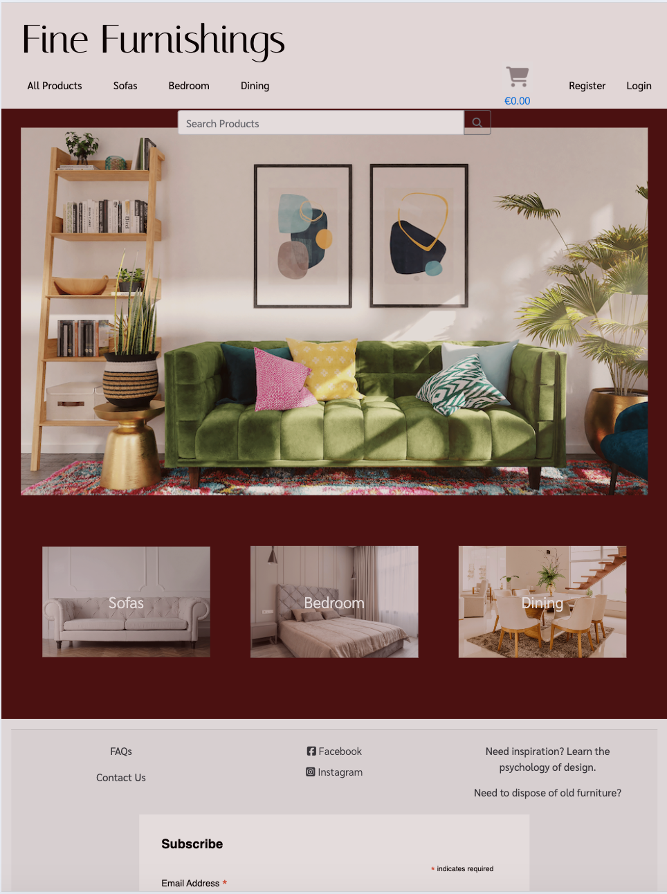
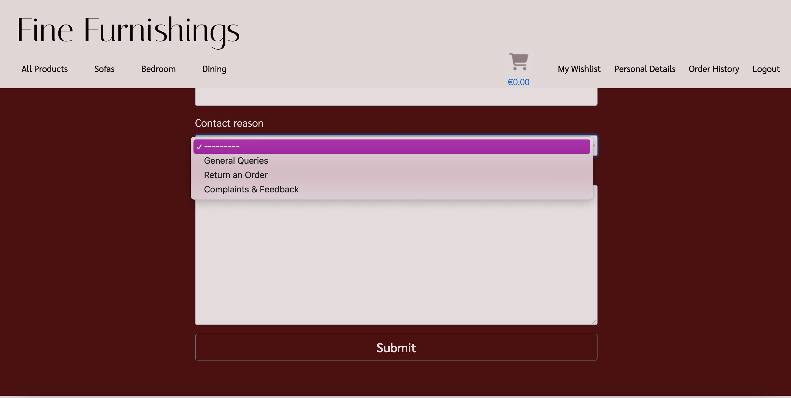
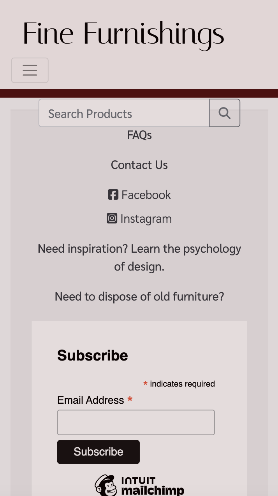
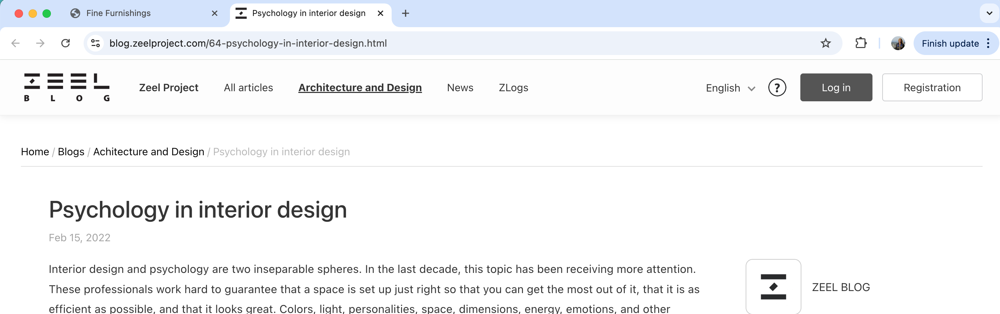
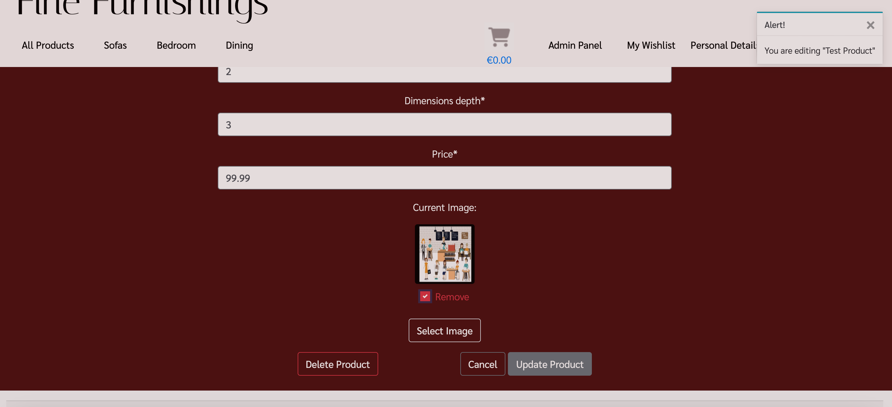

# Fine Furnishings


Fine Furnishings is a B2C focused online furniture store that will provide it's users a relaxing and trustworthy experience when purchasing new home furnishings. The goal of Fine Furnishings is to provide quality furniture to our customers as well as a seamless online experience that will provide them with peace of mind when purchasing from our company.

So many online experiences leave the user hesitating to make a purchase or stumbling through a website that is not user friendly. As we know how significant our surroundings and atmosphere are, our goal here, is to ensure that the user has easy accessibility to all the answers of any questions they may be asking when purchasing new furniture. If their question is not easily answered, we will provide an easy system of contact for the user to ask their specific question. 

Our goal is to provide simple navigation of the website so that our customers can purchase quality furniture from a trustworthy business.

### Deployed Site: 
https://fine-furnishings-1e63b49cdd1f.herokuapp.com/

# User Experience (UX)

## Project Planning

<details>

<summary> User Stories</summary>

- Planning of user stories completed in Google sheets:
[Google sheet](https://docs.google.com/spreadsheets/d/1xrrFyjqHdzZsPyJ-DnGmsfV3z4rvsZ0ZD8F23ye3utk/edit#gid=0)
- Link to my [GitHub Project](https://github.com/users/morganoleary/projects/5)

</details>

<details>

<summary>ERD Diagram - Lucidchart</summary>


</details>

<details>

<summary>Wireframes - Justinmind</summary>

- The wireframes for this project were created on the Justinmind local development environment for MacOS. Due to the time constraints for completing this project, I did not have the time to implement all device sizes for each page's wireframes. The mockups for these pages were used as a guide for the project as I continued to style more and adjust the pages during project creation and coding.


</details>

<details>

<summary>Design</summary>

- Using the color Red - psychology of color
I used the color Red as it has been proven to boost online sales. While the site has an overall red color, I created a more muted version to keep the site classy and more elegant for a more peaceful shopping experience. More information on this was found at [Crazy Egg](https://www.crazyegg.com/blog/colors-proven-to-boost-sales/).
- The content of the project was created by myself. I found the images and created the descriptions, pricing, etc. on all products. The content from the FAQs page is also created by me as an example of what I would like to see from a furniture store if I were the consumer.

</details>

## Marketing:

<details>

<summary>E-Commerce Business Model</summary>

- Fine Furnishings uses a business to consumer (B2C) direct sale business model. This is a furniture company that provides quality furniture to customers throughout the island of Ireland. The value of the company's services is huge as it provides a better well-being to everyone's day-to-day living within their homes. The business supplies furniture for consumers, customers are able to make purchases of the furniture on the Fine Furnishings website and the company is able to process orders via the website to complete each order placed.

- Fine Furnishings aims to provide high-quality, unique furniture pieces and the target audience focuses on homeowners in Ireland seeking stylish furniture. 
The store provides furniture in the following categories: 
    - Dining room furniture: dining tables, chairs & bar stools
    - Sofas: corner sofas, 3 seaters, 2 seaters, armchairs and occasional chairs
    - Bedroom furniture: bedframes in all sizes, storage, desks and bedside tables

- Customers are able to connect with the business through social media platforms, such as Facebook, as well as through the contact form to receive feedback from the company's customer service team.

- Fine Furnishings will continue to grow and add products and interior furnishings to the site, with a focus on bettering the livlihood of our client base.


</details>

<details>

<summary>SEO Implementations</summary>

- Descriptive meta tags & keywords are used throughout the site. In particular, the product descriptions and image file names. More keywords and meta tags will be used in future as the site content will bulk up about the business. 
- [sitemap.xml](https://www.xml-sitemaps.com/) was used to create and add the sitemap.xml file to the root directory.
- A robots.txt was added to the root directory of the project.

</details>

<details>

<summary>Facebook Screenshots</summary>


</details>

# Features

<details>

<summary>Existing Features</summary>

- Home page - this page was created to draw the users attention to a calm yet exciting color of site as well as an eye-catching image of the possibilities when shopping on this site.

Desktop:


Tablet:



Mobile:


- Home page product category blocks were added on the home page to allow users to navigate to specific furniture categories instead of using the navbar or search bar. This was first implemented with the idea that the home page will eventually contain much more content so that as the user scrolls through, they don't have the need of scrolling back to the top to search for products.

Desktop:


Tablet:


Mobile:


- Navbar - the navbar was designed for an easy user experience. On desktop and tablet, the text remains for easy navigation and on dropdown this shrinks to a hamburger menu with the same dropdown options. 

Desktop:


Tablet:


Mobile:


- User login/registration was implemented using Django AllAuth. These links can easily be found in the main navigation bar of the site on all pages.

Desktop Login:


Desktop Registration:


Tablet Login:


Tablet Registration:


Mobile Login:


Mobile Registration:


- When a user logs in or registers a new account, the menu options change to provide the user with a link to their personal wishlist, their personal details, order history and a logout option. When the admin/superuser is logged in, an additional 'Admin' option is available.

Logged out menu:


User logged in menu:


Admin/Superuser logged in menu:


- User Wishlist - this page can only be accessed when a user is logged in. If a user tries to add a product to the wishlist, they are prompted to register an account or login. On this page, the user can either navigate into each product page to read more and add to their cart, or delete the item from their wishlist.

Desktop Wishlist:


Tablet Wishlist:


Mobile Wishlist:


- User Personal Details - this page can only be accessed by a logged in user and autopopulates any saved details the user has previously added that is stored on the admin panel. From this page, the user has the option to edit their details and save or delete their account. 

Desktop - Personal Details:


Tablet - Personal Details:


Mobile - Personal Details:


- Edit personal details - When the 'Edit' button is clicked, a modal pop up gives the user the option to add multiple delivery addresses to save to their account if they wish. Addresses are able to be deleted when they are not attached to a user's order history.

Edit Modal:


Add address option, Delete address option & Save button:


- Delete account - from the personal details page, the user is able to delete their account. A pop up modal is in place to have the user verify this action should be completed before proceeding with deletion.


- Product Search Bar - the search bar can be found on all product pages of the site and allows users to filter searches if the word is found in the name of the product or within the description. Further search criteria to be expanded in the future.

Desktop - Search Bar:


Tablet - Search Bar:


Mobile - Search Bar:


- Product Categories & Filtered pages - the navbar provides an "All Products" option to view all products on the page as well as the three main categories of "Sofas" "Bedroom" and "Dining" that provide dropdown menus to filter each category further to specific types of items. Users are able to add items to their wishlist from these product pages.

Desktop - Category dropdown:


Armchair category selected:


Mobile - Category dropdown:


- Product Detail page for each product - each product contains the following details: Name, Image, option to add to wishlist, Price, Product ID, Quantity Selector, Add to Cart option, Description and Dimensions. Bedframes also have a Size selector option of 3', 4', 4'6", 5' and 6', as well as all sizes of dimensions listed.

Desktop Product Details page:


Bedframe with size selector - Product Details page:


Tablet Product Details page:


Mobile Product Details page:


- Shopping Cart page to view before purchasing - this page allows the user to view the products added to the basket and adjust items and quantities before continuing to checkout to purchase. Within the cart, the user is able to delete items from the cart as well as adjust quantities and see the price adjust with the changes.


- Secure Checkout page for the user to checkout with Stripe - the checkout page provides the user with an Order Summary of what they are about to purchase, a form to fill in any details - if not already supplied in the personal details page - and a card input to pay securely with Stripe's payment system.

Desktop Checkout:


Mobile Checkout:


Stripe Payment Success:


- Order Confirmation - upon a successful purchase, the user is taken to an order confirmation page to show their order number and details. At this stage, the cart is emptied and the balance reverts to 0.

Desktop - Order Confirmation:


Tablet - Order Confirmation:


Mobile - Order Confirmation:


- The user's order is stored in the user's 'Order History' on their individual profile, and the user has access to this from the navbar when logged in.


- FAQs page - this page can be found in the footer of the site and provides dropdown questions and answers for frequently asked questions the business is expecting a user to ask. This page also provides a link to the contact form page in case a user's question is not answered in the FAQs provided.


- Contact Us page - this page can be found in the footer of the site and can be accessed by both registered & unregistered users. The form requires fields to be field out before it can be submitted and provides a dropdown for the possible reasons a user may be sending a query to the business: General Queries, Return an Order, Complaints & Feedback.




- Logout - this option is only available to logged in users. When clicked, the user receives a prompt to ensure the user wants to continue logging out.

Desktop:


Tablet:


Mobile:


- Footer links - the footer is visible on all pages of the site and provides links to the following: FAQs page, Contact Us page, Social medial links for Facebook & Instagram (opening in a separate window), two external site links and a newsletter signup form:

Desktop:


Tablet:


Mobile:



- Mailchimp Subscription form working to store contact emails on Mailchimp:

Mailchimp success message:


Mailchimp account updated:


- A custom 404 page has been created - this page includes a link back to the home page OR to the contact form for the user to send any queries about why a certain page was not found.


- The Admin Dashboard is fully functional for the site owner to navigate through user accounts - including email addresses, personal details, wishlist items, saved addresses (see more in bugs on addresses) & orders placed. The admin dashboard also includes a place for the site owner to add, update and delete, products, product details and product categories. A section is also included to store contact requests from the site's contact request form.


- ADMIN PRODUCT CRUD - When the superuser is logged in, the Admin dashboard can be easily accessed from the menu. From the Admin dropdown, this also provides a link that allows the superuser to add a product. Superusers are able to edit & delete products from the UI instead of being required to exit the site and navigate to the admin dashboard. The deletion of a product provides a warning before deleting the product to ensure deletions are not accidental.

Add product menu dropdown option:


Adding a product page:


Edit product button on each product tile:


Edit & Delete buttons accessible on each product detail page:


Product delete button on the edit page of a product:


Warning before deletion of a product:


- Stripe Webhook handlers and email confirmations have been implemented to give the user better feedback during the checkout process.

Stripe Webhook:


Order confirmation email:


________________

#### External Links in Footer

- A link to [kollect.ie](https://kollect.ie/) can be found in the footer as many customers looking for new furniture will be in need of a service to dispose of their old furniture. Since Fine Furnishings does not offer these services, this provides our users with a simple solution to their disposal needs.
- A link can be found in the footer to the [Psychology of Design blog](https://blog.zeelproject.com/64-psychology-in-interior-design.html). Many consumers, looking to purchase furniture, would like help and assistance in making a decision for what suits their home and needs best. The customer can always contact the business with any questions, but this blog provides a simple read to give the customer some ideas of what they may be looking for.

</details>

### Future Implementations

<details>

<summary>Future Features</summary>

- In future features, the site's home page will contain a Google Map for the company's location. 
- In future features, an About Us page will be implemented to give the user more information about the company.
- In future features, the site will have a section for company reviews to help showcase the company's reputation and drive new users to the site. This would be implemented with a link to a Trustpilot review page in the footer as well. 

</details>


# Testing
<details>

<summary>Validator Testing</summary>

- **HTML** of each page on the deployed site was checked with [W3C-Markup Validation Service](https://validator.w3.org/#validate_by_input):
All pages were tested with no errors. The only warnings showing are from the script text for the footer Mailchimp newsletter signup javascript code. As these were only warnings, I thought it would be best to leave the code as is since this was taken direcly from Mailchimp's instructions:


- **CSS** of the deployed site was checked with [W3C-The W3C CSS Validation Service](https://jigsaw.w3.org/css-validator/) and no errors were found:


- **Javascript** of the deployed site was checked with [JSHint](https://jshint.com/):
On the Product app's quantity_input_script.html a few warning were listed, however when the template literatls were changed to regular '' (to remove the error) the functionality of the quantity selector did not work. This was implemented using the Boutique Ado walkthrough:

On the Checkout app's stripe_elements.js, a few warnings were thrown, but the code is working perfectly. This was implemented with the help of the Boutiqe Ado walkthrough.

On the Cart app's shopping_cart.html, the javascript at the bottom of the file was checked with minor warnings. This was implemented using the Boutique Ado walkthrough:


- **Python** was checked with the [CI Python Linter](https://pep8ci.herokuapp.com/)
As I was checking the Python code of the base.html file - the checker was throwing many errors of missing whitespace and unexpected indentations on all lines. From going through this course and following along with the content, I have matched the expected indentations and have continued coding the same way and have never had these issues. I have fixed all lines that are too long, but did not want to change the code and remove all indentations as that would make everything messy and unreadable.

Going through each page is causing the same errors - I am fixing an lines that are too long and any lines that have trailing white space, but I can not fix all the missing white space around operator and take out all the indentations as that will muddle the code and is far too time consuming with the submissiong deadline. I would like to know if this is a fluke in the linter? Here are some examples:


- **LightHouse** Report:
The lighthouse report was checked on my deployed site and each area has greatly improved since my first submission of this project. 

Testing Mobile:


Testing Desktop:


</details>

<details>

<summary>Manual Testing</summary>

### Testing the Home page & Navigation Bar:

- Expected: Upon loading the home page as well as navigating to this page from different pages throughout the site, the navigation bar, images, search bar, category blocks and footer are all expected to be visibly apealing and functional. 
- Testing: While testing the page, I ensured to log in and log out of the site to make sure all home page and navigation features are working as expected. All images are populating and links are working correctly in all areas of the home page. 
- Outcome: The navigation bar populates correctly depending on if the user is logged in or logged out. The design of the home page is visually appealing and offers simple navigation. 

Logged out menu - no user profile options are available:


Logged in menu - user profile options available:


Admin/Superuser logged in menu - provides the additional admin dropdown options in the menu:


The category blocks on the home page are navigating to the correct page from the home page:


The bedroom products appear when the 'Bedroom' block is clicked:


### Testing the Register, Login & Logout functions:

- Expected: When a user clicks on the register button, they will be prompted to register their details for a new account. A user who already has an account should be able to use their store username/email and password to login to the site with no issues. When a logged in user is ready to log out, they will be able to do so with no issues and will be prompted to confirm their log out request. 
- Testing: While testing the registration button, I tried to break the registrations by purposely leaving out requested details. 
- Outcome: For registrations, users are taken to a page to add their details and double check both the email and passwords are correct before registering. They are not allowed to register without completing all fields:

#### Registration

Empty field test - does not allow the user to register without completing all required fields:


The user receives a prompt to verify their email address:


An email is then received to verify the user's email address (temp-mail was used for this test):


The user is then rerouted to the site to confirm their email:


A success message appears of the confirmed email & the user is redirected to the log in page: 


#### Login

When the user logs in with the newly registered account, a successful login message appears with the updated user profile menu options:


When a user decides to log out, they are prompted to confirm before doing so:

#### Logout


A success message is shown upon a user being logged out:


###  Testing Wishlists & Personal Details - including Multiple Addresses:

- Expected: For new users, the personal details and wishlist menu options appear but the content should be empty.
- Testing: I registered a new account and navigated to both the wishlist page and personal details pages to ensure all are working properly. I added details to the personal details page and saved. I added products to the wishlist a saved. 
- Outcome: The personal details page only populates the new user's email as expected and upon adding more details, the user can see their updates once clicking 'save'. The wishlist works as expected and is empty until products are added. When products are added, they are saved to the user's profile on the admin dashboard.

#### Personal Details

The user's details are empty when first navigating to 'Personal Details':


##### Multiple Addresses

When the profile modal first opens, the user is able to add their basic details and can choose to 'Add Address' if they wish:


If all required fields are not completed, the user will receive an error message to correct the errors:


- There is a bug here, where if the user forgets a field and is prompted to fix the error, even when the user fixes the error, the form will not save. The user must exit the modal or delete the address being added and start over. This will be fixed in future iterations.

When the address is filled in correctly, the country field autopopulates to 'Ireland' as expected, as this is the only country allowed for this business:


A success message appears to confirm the saved details and the user's information is saved while populating the profile page once the user adds new details:


The user is able to add multiple addresses with different names:


Addresses are able to be deleted when they are not connected to a user's order. The user is prompted to confirm they want to delete an address and this will be deleted once the user 'saves changes':


As expected, an address cannot be deleted if it is associated with a user order:


A success message is shown when an address is deleted and the user's profile is updated accordingly:


#### Wishlist

The wishlist is empty when a user first registers:


Products are able to be added to the wishlist with a success message for each added product:


Products are able to be deleted within the wishlist. A message appears to confirm that the product was removed and the wishlist is updated accordingly:


The user profile details save to the user's account. When a user logs out and logs back in, all the user's personal details and wishlist items are saved correctly. 


### Testing the FAQs page:

- Expected: The FAQs page should be accessible and a working link in the footer of all pages. 
- Testing: I tested to ensure the FAQs page worked whether a user is logged in or logged out. I tested each dropdown menu to make sure each is populating the answer correctly and I tested the link to the contact page from the FAQs page. 
- Outcome: The FAQs page works as expected, all dropdown choices work and the link to the contact page redirects the user to the Contact Form page.


### Testing the Contact Us page:

- Expected: The Contact Us page should be accessible from the footer to both logged in and logged out users. The form should require users to fill out all required fields. The submit button should be clickable and send the contact form to the admin site. A success message should appear to the user that the message has been sent. 
- Testing: I navigated to the contact page as both a logged in and logged out user. I tried submitting a form that did not have all fields filled out. I submitted a completed form and checked that the form was reflected on the admin panel.
- Outcome: The contact page is accessible to all users from the footer, the FAQs page and the 404 page. The form will not allow a user to submit without completing all required fields. Once submitted, the user receives a success message and the contact request is documented on the admin dashboard.

Empty field test:


Success message for successful contact form sent:


The Admin dashboard updates and receives the contact form message:


### Testing the footer links:

- Expected: The footer links for social media and external sites are expected to open in a new window. 
- Testing: I clicked on each link - Facebook, Instagram, psychology of design blog and the disposal site. 
- Outcome: All links worked properly and opened in separate windows:

##### Footer links:


Example: Psychology of Design link opens in new window:



Example: Kollect disposal link opens in new window:


##### Mailchimp

- Expected: The Mailchimp newsletter signup form works and registers the new email address on the businesses Mailchimp account. 
- Testing: I tried to submit the form without adding an email. I submitted an accurate email into the form. 
- Outcome: The form cannot be submitted without an email address being entered. Once submitted with a correct email, the form shows the success and the new email is registerd on the Mailchimp account.

Empty field test:


Signup success message:


The mailchimp account is updated with the new email:


### Testing the product search pages, product details pages and search bar.

#### Categories

- Expected: The product category pages should be accessible from the navigation menu dropdown options and filter correctly to the products selected. 
- Testing: I tested all links in the main navigation menu to ensure they opened to the filtered categories. 
- Outcome: All product categories work correctly from the dropdown and filter the products whether the user selects 'all products', 'all sofas', 'all bedroom', 'all dining' and their respective subcategories. 

Test dropdown category 'Bedside Tables':


Test dropdown category 'Bar Stools':


#### Search Bar

- Expected: The search bar should filter through all products if the search criteria exists within the product name or description. 
- Testing: I searched for colors and products within the database. I also searched for products that I know do not exist as well as searching for the plural of 'tables' etc. 
- Outcome: The products are filtered correctly when the search criteria exists, however (**`BUG`**) when searching for the plural of a word, the search does not work. This search criteria will be further expanded in future and especially as more products are added to the shop.

Test search criteria 'blue':


Test search criteria 'tables' (**`BUG`**):


The search for 'chair' correctly populates any 'sofa' chair or 'dining' chair on the site:


#### Product Detail Page

- Expected: Each product should have a product detail page the is accessible by clicking on the individual products from the filtered category pages. The product detail page should include the name of the product, the option to add the item to the wishlist, the price, the product id, a quantity selector, the option to add the product to the cart to purchase, an image, a description and dimensions for the chosen product. Bedframes should have size options available in a dropdown to choose 3', 4', 4'6", 5' & 6'
- Testing: All products have been tested to ensure each product contains the relevant details. I added the products to the wishlist to ensure the heart icon link is working. I increased and decreased the quantities and added the item to the basket. For bedframes, I added different sized to the cart. 
- Outcome: All products are able to be added to the wishlist (when a user is logged in) and the products can be added to the cart. The quantity selector works correctly and the user cannot choose below 1 or above 50. Bedframes have size selectors and the correct size gets added to the cart. 

Product page test:


Bedframe size changed & quantity updated test:


### Testing the shopping cart:

- Expected: Any user, logged in or not can add items to the cart. Within the cart the user should be able to adjust quantities of products, remove products entirely and navigate to the checkout page. The total of the order should adjust with each change and be reflected on the cart icon in the menu as well. Delivery should be automatically added to the product total.
- Testing: I tried adding a product to the cart when not logged in and when logged in, I added products to the cart, including a bedframe with a specified size. I tested the quantity selector on the cart and deleted an item from the cart. I navigated to the checkout page. 
- Outcome: When not logged in, the user is able to add items to the cart, but if they try to navigate to the checkout page, the user is redirected to the log in page to either log in or register a new account. Selected quantities of an item transferred correctly to the cart. Bedframes and select sizes transferred correctly to the cart. I was able to delete items and adjust quantities of items in the cart. I was able to navigate to the checkout page from the cart. Product totals were adjusted correctly with the changes and the delivery charge was added before navigating to checkout.

Items added to cart with quantities and sizes:


Item deleted from cart:


Quantity of sofa adjusted correctly in cart:


Products added to cart and then navigating to the checkout page:

1. When a user is not logged, they are redirected to login and not the checkout - 


2. When a user is logged in, they are directed to the checkout page with the items included in the cart - 


### Testing the secure checkout page:

- Expected: Only logged in users can navigate to the checkout. The products and order summary total will carry over from the user's cart. Any saved details will be autopopulated in the checkout form. A Stripe card input will be available for the user to checkout and a note with the amount to be charged will be clearly visible. The user will be able to submit the payment OR navigate back to the cart to make changes to the order before purchasing. 
- Testing: As a logged in user, I tried updating the details on the checkout form and added Stripe test card details to submit the order. I tried using the 'Update Cart' button to go back to the cart. I tried submitting the payment with missing details to make sure the payment/order does not go through. 
- Outcome: From following the above steps and adding the items to the cart to proceed to checkout, the correct items and pricing carried over to the checkout page. I was not able to submit the checkout form without all required details filled out and a message appears to the user to complete the form fully. I logged out and logged back in as the last newly registered user I had created, added new items to the cart (including a bedframe with size selected), and was able to checkout sucessfully and was sent to the order confirmation page. 

Once nagivated to checkout, the logged in user's details autopopulate in the checkout form:


Checkout field required - if a field is missing, the form will not be submitted:


Stripe test card details added - the amount to be charged is clearly visible in bright yellow to warn the customer before submitting their payment:


Upon successful checkout, the confirmation page appears with the order details:


Upon successful checkout, the Stripe events were updated with the successful payment. No charge was attempted on Stripe previously when the field was missing and only succeeded when the form was fully completed:


From the order confirmation page, I was able to click the 'keep shopping' button to navigate back to all products:


The admin panel was updated with the new order details:

1. Order added to 'Orders' - 


2. Order details correct within order - 


-----------
(**`BUG FIXED`**) Previously, there was an error where orders were being placed and duplicate orders were created, causing a major bug in the checkout process. This has been solved by implementing 'unique_together' on the model as well as updating the stripe_elements.js file. The issue was occurring because the OrderForm requires that the 'country' field be completed for checkout, however the stripe_elements_js did not require this. So when the user selects a different address from the dropdown and the country field does not populate, if the user tries to submit the order without completelin that field, the form tells the user there is an error, while Stripe didn't stop the payment from going through, causing duplicate orders to be placed. This has been fixed by adding the 'country' field to the required fields that Stripe looks for, so IF the field is not completed, Stripe will NOT process the payment and Stripe will throw an error for this. 

-------------
#### Testing checkout with missing country field

I logged out and back in again and attempted a few more checkouts that were all successful. There is a small (**`BUG`**) when the user selects a different address from the dropdown at checkout. The fields populate all except for the country field. However, this does not create any issues to being able to complete an order once the field is filled out. When the order is attempted, the user receives an error message. If the user selects an address from the dropdown but fills in the country field, by selecting the Ireland option, the order will go through successfully. The country field is populating Ireland ONLY successfully as this business only delivers within Ireland. 

If an address is selected from the dropdown of user addresses, the country field does not automatically populate:


An error appears to let the user know they need to fill out all address fields:


Once the form is filled in correctly, the order succeeds and leads the user to the confirmation page - no duplicate order is created:


### Testing the Order History:

- Expected: Only logged in users can navigate to the order history page. The order history page should populate the specifc user's previous orders so they can monitor their purchases. The orders should appear in the user's orders on the admin dashboard as well.
- Testing: As a logged in user, I navigated to the Order History page. I investigated the admin dashboard to ensure orders were appearing on the user's account.
- Outcome: The order history page correctly populated the user's orders that were previously placed on the site. The admin dashboard has correct records of the user's previous order history as well. 

The logged in user's order history page was populated with orders:


A logged out user does not have access to the 'Order History' page:


Orders are populated on the admin dashboard:

1. Admin dashboard - Orders updated correctly:


2. Admin dashboard - User's Profile updated with orders:


### Testing the custom 404 page:

The 404 page was also tested by typing random letters after the deployed url and appears correctly. 

The buttons work as expected to navigate the user back to the home page OR to the contact us page to submit a query:


### Testing the Admin Product CRUD:

- Expected: Only logged in superusers and admin have access to the admin UI. Logged in admin should be able to add a new product, edit existing products and delete existing products. A warning should appear when deleting a product to ensure this action is not a mistake.
- Testing: When logged out, I tried navigating to the admin UI by adjusting the urls to access the product CRUD options on the UI. When logged in as the super user, I added a new product successfully. I also attempted to add a new product with a missing required field. I used the edit button on both the product search pages, as well as the product detail page, in order to edit a product and save the changes. I deleted a product to ensure the warning modal appeared.
- Outcome: From following the above tests, I was able to add a new product and when a field was missing, it correctly warned me to fill in the missing field. I was able to navigate to the edit page on the product and product detail pages. I was able to delete a product successfully after confirming the deletion in the pop up modal. The admin product CRUD cannot be accessed by using the correct urls and by doing so this takes the user to the sign in page. 

Adding a product works successfully:


A product cannot be added with a missing field:


When a product is added successfully, a message appears and the user is navigated to the new product detail page:


Upon clicking the 'edit' button, the user is taken to the edit page to make changes:



When the admin clicks 'update product', the product is updated successfully with a success message:


A warning appears before deleting a product:


Upon deleting a product, a success message appears:


A user is not able to enter the Admin UI to access the product CRUD abilities when not a logged in superuser:


</details>

<details>

<summary>Bugs/Unfixed Bugs</summary>


- The search bar works as it should, however I noticed that a user is unable to search for the multiple description of an item such as 'tables' or 'sofas' and only the singular works. In future implementations I will learn more on how to expand the search criteria.

- On the checkout page, the order summary is below the payment input on mobile screens. In future, the order summary will come before the user can submit a payment. 

- The python validator showed quite a few errors of missing spaces and unexpected indentations, however I don't believe these things are actually meant to be updated? Documented in the Validator testing portion above. There were a few lines of code that were marked as too long, but as the lines contain functions and class strings, to my knowledge, there is no simple fix for this. In future I will look further in these lines marked "too long" and will learn how to negate the warning. Due to time constraints, I did not have enough time to fix these for submission.

- At checkout, if the user uses the 'Select an Address' dropdown, the fields populate with the changed address, however the country field does not populate. Ideally this field should populate only with Ireland as an option and will be fixed in future releases. The user receives an error and the checkout works correctly when the user manually fills out the field.


- An overlay / spinner was implemented, however was not appearing as it should on the site. After working with tutor support and being unable to find a solution, I was advised that it would be best to remove this altogether. I plan to reimplement this successfully in future features.

- The layout of the shopping cart on mobile devices will be updated further in future, as the titles should appear in line with their relative details. The technical features of the shopping cart work as intended.


</details>

# Deployment

<details>
<summary>Steps taken to deploy on Heroku</summary>

### Set up the workspace:
1. **Install gunicorn** in the workspace for Heroku deployment:
 ```bash
 pip install gunicorn
 ```
2. **Update `requirements.txt`**:
 - Freeze installed packages to `requirements.txt` to ensure all dependencies are tracked:
 ```bash
 pip freeze > requirements.txt
 ```
3. **Create a `Procfile`**:
 - This file tells Heroku how to run your app. Add the following line to a new file named `Procfile`:
 ```bash
 web: gunicorn fine_furnishings.wsgi:application
 ```

4. **Modify `settings.py`**:
 - Set `DEBUG = False` for production to disable debugging mode in deployment.

5. **Configure Static Files and Media Storage**:
 - Ensure you have proper static and media file configurations for deployment with Heroku. For example, using **Cloudinary**:
 ```python
 # settings.py
 CLOUDINARY_STORAGE = {
 'CLOUDINARY_CLOUD_NAME': 'dab35wlwh',
 'CLOUDINARY_API_KEY': 'your-cloudinary-api-key',
 'CLOUDINARY_API_SECRET': 'your-cloudinary-api-secret',
 }

 STATIC_URL = '/static/'
 STATICFILES_STORAGE = 'cloudinary_storage.storage.StaticHashedCloudinaryStorage'
 MEDIA_URL = '/media/'
 DEFAULT_FILE_STORAGE = 'cloudinary_storage.storage.MediaCloudinaryStorage'
 ```
 - Add your **Heroku app URL** to the `ALLOWED_HOSTS`:
 ```python
 ALLOWED_HOSTS = ['fine-furnishings-1e63b49cdd1f.herokuapp.com', 'localhost']
 ```

6. **Securely Manage Secrets**:
 - Ensure all sensitive keys (e.g., `SECRET_KEY`, API keys) are stored in **environment variables** (not hardcoded in `settings.py`):
 - Add these keys to `env.py` (or use **Heroku's Config Vars**) and ensure `env.py` is in `.gitignore`.

7. **Git Add, Commit, and Push**:
 - Once changes are made, ensure you commit and push them to GitHub:
 ```bash
 git add .
 git commit -m "Prepare for Heroku deployment"
 git push
 ```


### **Deploy on Heroku**:

8. **Create the App on Heroku**:
 - In the Heroku Dashboard, click "New" > "Create new app" and follow the prompts.

9. **Connect the GitHub Repository**:
 - Under the "Deploy" tab, link your Heroku app to the GitHub repository that contains your code.

10. **Set Config Vars** in the "Settings" Tab:
 - In the **Config Vars** section, add the following:
 - `CLOUDINARY_API_KEY`
 - `CLOUDINARY_API_SECRET`
 - `CLOUDINARY_CLOUD_NAME`
 - `DATABASE_URL`
 - `SECRET_KEY`
 - `STRIPE_PUBLIC_KEY`, `STRIPE_SECRET_KEY`, `STRIPE_WH_SECRET`
 - `EMAIL_HOST_USER`, `EMAIL_HOST_PASS`
 
 Ensure all sensitive information is kept secure by using Config Vars, not hardcoding them.

11. **Run Database Migrations** (if needed):
 - Navigate to the **Heroku CLI** and run:
 ```bash
 heroku run python manage.py migrate
 ```

12. **Collect Static Files**:
 - You may need to collect static files to ensure proper delivery:
 ```bash
 heroku run python manage.py collectstatic --noinput
 ```

13. **Deploy the App**:
 - In the **Deploy** tab, scroll down to the "Manual deploy" section and click **Deploy Branch** to deploy the main branch.

14. **Test the Deployment**:
 - After deployment, visit your app's URL and ensure it works as expected. Test different parts of the application for any errors.

</details>


<details>
<summary>Steps to deploy locally</summary>

1. **Ensure Python and Pip are Installed**:
 - Install the latest versions of both if not already installed.

2. **Set up a Virtual Environment**:
 - If needed, create and activate a virtual environment to isolate your dependencies:
 ```bash
 pip install virtualenv
 virtualenv venv
 source venv/bin/activate
 ```

3. **Install Dependencies**:
 - Install the required dependencies from the `requirements.txt`:
 ```bash
 pip install -r requirements.txt
 ```

4. **Apply Database Migrations**:
 - Run migrations to set up the local database:
 ```bash
 python manage.py migrate
 ```

5. **Create a Superuser**:
 - Create a superuser account to access the admin dashboard:
 ```bash
 python manage.py createsuperuser
 ```

6. **Collect Static Files**:
 - If required, collect static files for the local environment:
 ```bash
 python manage.py collectstatic
 ```

7. **Configure Debug Settings**:
 - In `settings.py`, set `DEBUG = True` to enable debugging mode for local development.

8. **Run the Local Server**:
 - Start the local development server:
 ```bash
 python manage.py runserver
 ```
 
 Open your browser and go to `http://127.0.0.1:8000/` to view the project.

</details>

<details>
<summary>Fork Repository</summary>

1. **Navigate to the Repository**:
 - On GitHub, go to the repository page you want to fork.

2. **Click the Fork Button**:
 - In the top-right corner of the page, click **Fork**.

3. **Create a Copy**:
 - Wait for the forked repository to be created. Then you will be redirected to your new fork.

</details>

<details>
<summary>Clone Repository</summary>

1. **Navigate to the Repository**:
 - On GitHub, open the repository page you want to clone.

2. **Copy the HTTPS URL**:
 - Click the green **<>Code** button and copy the URL from the **HTTPS** tab.

3. **Clone in Git Bash**:
 - In your terminal (Git Bash), run the following command with the copied URL:
 ```bash
 git clone https://github.com/morganoleary/Fine-Furnishings.git
 ```

4. **Check Your Local Clone**:
 - Navigate to the cloned directory and start working with your local copy.

</details>


# Credits

<details>

<summary>Content</summary>

- The Boutique Ado Walkthrough was referenced when setting up Django, Allauth and the base template.
- The [Boutique Ado Walkthrough](https://learn.codeinstitute.net/courses/course-v1:CodeInstitute+EA101+2/courseware/eb05f06e62c64ac89823cc956fcd8191/0fb892bc636a44cf94b69d9f2aa9166a/?child=first) was referenced when creating product pages & search bar functionality.
- [Django documention](https://docs.djangoproject.com/en/dev/ref/models/querysets/#iexact) was referenced when utilizing iexact in creating the product category links.
- [Stack Overflow](https://stackoverflow.com/questions/35796195/how-to-redirect-to-previous-page-in-django-after-post-request) helped me redirect users to the previous page without using the 'back' button on the browser.
- The contact app, was largely taken from my previous project [Sould Base Studio Booking Site](https://github.com/morganoleary/studio-booking-site)
- [Bootstrap Collapse Documentation](https://getbootstrap.com/docs/4.6/components/collapse/) was used to implement the dropdown answers on the FAQs page.
- [FreePik.com](https://www.freepik.com/free-photos-vectors/ff-logo) was used to create a mockup of a logo for the company for the Facebook page.
- Updating the shopping cart with quantity functionality & size options for the bedframes was implemented with a great help from the [Boutique Ado Walkthrough - Adding Products](https://learn.codeinstitute.net/courses/course-v1:CodeInstitute+EA101+2/courseware/eb05f06e62c64ac89823cc956fcd8191/f324de58c90e47bd9497bf5839cf1859/)
- [Stack Overflow](https://stackoverflow.com/questions/47258289/differences-between-stacked-inline-and-tabular-inline) was referenced when creating the admin user profile and address fields.
- [Django Docs - forloop.counter](https://docs.djangoproject.com/en/3.1/ref/templates/builtins/#for) & [Django Docs - modelformset_factory](https://docs.djangoproject.com/en/5.0/ref/forms/models/#:~:text=modelformset_factory%20%C2%B6&text=Returns%20a%20FormSet%20class%20for,passed%20through%20to%20modelform_factory()%20.) were utilized when implementing the functionality of the users addresses and being able to add multiple to the same account. 
- [w3things.com](https://w3things.com/blog/rel-noopener-noreferrer/) was referenced when implementing the rel attributes on external site links in my project.
- Implementing Mailchimp as a newsletter signup in the footer of the site was implemented by following along with Code Institute's [Web Marketing Video - Newsletter Marking with Mailchimp](https://learn.codeinstitute.net/courses/course-v1:CodeInstitute+DRWM101+2021_T1/courseware/2b2a6057abf44272955637c09687ab43/acc4b7d56e3a400ebe110e5d734ce767/).
- The Code Institue [Intro to SEO video](https://learn.codeinstitute.net/courses/course-v1:CodeInstitute+SEO101+2021_T1/courseware/8602519909ff453c8d6e03d3169f92ac/213de39016ca41fdb2b93aa2e0283c51/) was followed when implementing the sitemap.xml and robots.txt file. 
- [Seobility - Meta Description](https://www.seobility.net/en/wiki/Meta_Description?utm_id=8783357192_87472061486&utm_source=google&utm_medium=cpc&utm_cid=8783357192&utm_agid=87472061486&utm_campaign=geoEN-Wiki&utm_dev=c&utm_devicemodel=&utm_mt=p&utm_term=meta%20description&gad_source=1&gclid=CjwKCAjw74e1BhBnEiwAbqOAjJcEmDVRAzc9jjXaEWVd6gRPL_EEVM71JSMEC9f2e-j1pcTF37Zv0RoCBJIQAvD_BwE) was used to research implementing meta descriptions for each page of the site. The [snippet generator](https://www.seobility.net/en/serp-snippet-generator/?url=&platform=desktop) was used to check that the meta descriptions created are viewed well on desktop and mobile previews.
- The [Boutique Ado Walkthrough content on Toasts](https://learn.codeinstitute.net/courses/course-v1:CodeInstitute+EA101+3/courseware/eb05f06e62c64ac89823cc956fcd8191/9b257df92c9e4149bf90203b6c5ae1af/) and the [Bootstrap Documentation](https://getbootstrap.com/docs/4.6/components/toasts/) were used to implement toasts and messages into my project. 
- Implementing 'unique_together' to the order and order items model was added to fix the order duplication error. [This Django documentation](https://docs.djangoproject.com/en/5.1/ref/models/options/#unique-together) helped to fix the order duplication error.
- The Boutique Ado walkthrough project was utilized to implement the product CRUD capabilities for the admin/superuser.

</details>

<details>

<summary>Technologies Used</summary>

- LucidChart = ERD
- Justinmind = wireframes
- [Pexels.com](https://www.pexels.com/) = product images 
- [Unsplash.com](https://unsplash.com/) = product images
- [Adobe Express Converter](https://www.adobe.com/express/feature/image/convert/jpg-to-png) = convert all jpg images to png
- [Compress PNG](https://compresspng.com/#google_vignette) = compress all png images
- [Fonticon](https://gauger.io/fonticon/) = generate site icons
- Django = Framework
- HTML = mark up language
- CSS = styling
- Bootstrap = styling
- Python = functionality
- VS Code = IDE
- Stripe = payment system
- Cloudinary = web hosting of product images
- Heroku = Deployment
- GitHub = Used to store the project
- Git = version control
- [PostgreSQL from CI](https://dbs.ci-dbs.net/) = database
- [Am I Responsive](https://ui.dev/amiresponsive) = multiple screen size views

</details>

<details>

<summary>Acknowledgements</summary>

- I would like to give a huge shout out to the tutor support team. Sarah, Roman, Oisin, Roo & Thomas were a great help while I ran into issues with implementing Cloudinary, git actions between GitPod & VS Code and issues deploying on Heroku with static files and Cloudinary.
- I would like to thank my mentor, Narender, for his time and support on this project. As we were limited in meetings, he continued to stay supportive and helped keep me positive through the stress! Thank you.
- I would like to extend a huge thank you to Code Institute for this course. This has been an amazing opportunity that I never thought would be a part of my future and I am excited to continue my coding journey and begin my new career as a software developer! You have provided great resources throughout the last year and it has completely changed my life. Thank you so much for this opportunity.

</details>