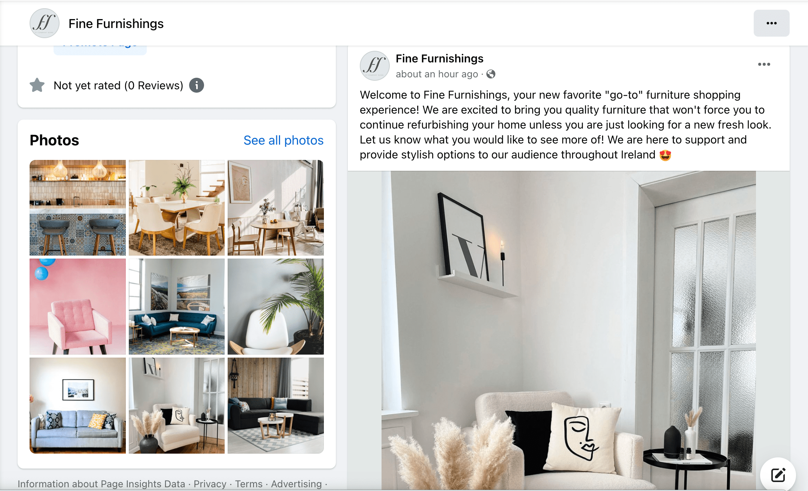
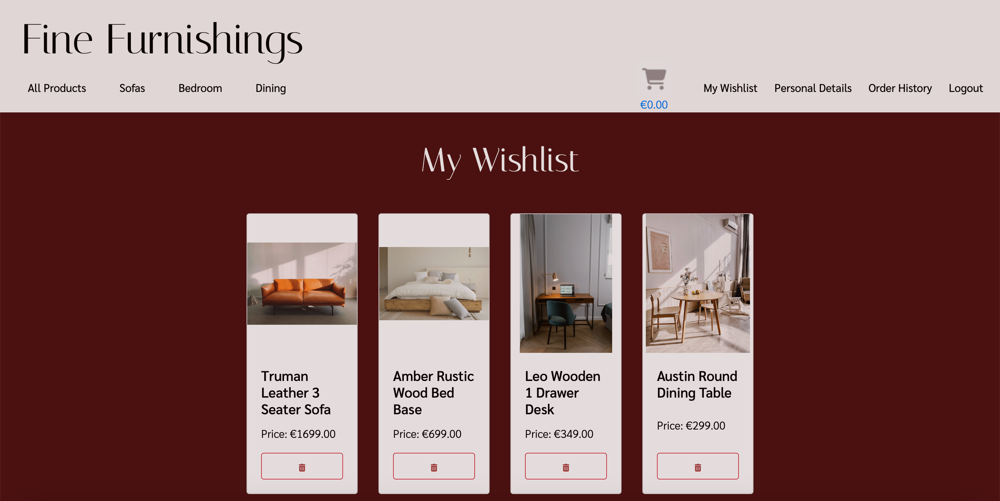
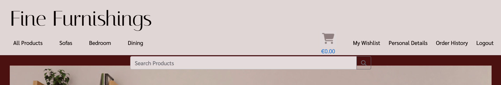

# Fine Furnishings

Fine Furnishings is a B2C focused online furniture store that will provide it's users a relaxing and trustworthy experience when purchasing new home furnishings. The goal of Fine Furnishings is to provide quality furniture to our customers as well as a seamless online experience that will provide them with peace of mind when purchasing from our company.

So many online experiences leave the user hesitating to make a purchase or stumbling through a website that is not user friendly. As we know how significant our surroundings and atmosphere are, our goal here, is to ensure that the user has easy accessibility to all the answers of any questions they may be asking when purchasing new furniture. If their question is not easily answered, we will provide an easy system of contact for the user to ask their specific question. 

Our goal is to provide simple navigation of the website so that our customers can purchase quality furniture from a trustworthy business.

### Deployed Site: 
https://fine-furnishings-1e63b49cdd1f.herokuapp.com/

# User Experience (UX)

## Project Planning

 User Stories

- Planning of user stories completed in Google sheets:
[Google sheet](https://docs.google.com/spreadsheets/d/1xrrFyjqHdzZsPyJ-DnGmsfV3z4rvsZ0ZD8F23ye3utk/edit#gid=0)
- Link to my [GitHub Project](https://github.com/users/morganoleary/projects/5)

ERD Diagram - Lucidchart

Wireframes - Justinmind

- The wireframes for this project were created on the Justinmind local development environment for MacOS. Due to the time constraints for completing this project, I did not have the time to implement all device sizes for each page's wireframes. The mockups for these pages were used as a guide for the project as I continued to style more and adjust the project during project creation and coding.

Design

- Using the color Red - psychology of color
I used the color Red as it has been proven to boost online sales. While the site has a red overall color, I created a more muted version to keep the site classy and more elegant for a more peaceful shopping experience. More information on this was found at [Crazy Egg](https://www.crazyegg.com/blog/colors-proven-to-boost-sales/).
- The content of the project was created by myself. I found the images and created the descriptions, pricing, etc. on all products. The content from the FAQs page is also created by me as an example of what I would like to see from a furniture store if I were the consumer.

## Marketing:

E-Commerce Business Model

- Fine Furnishings uses a business to consumer (B2C) direct sale business model. This is a furniture company that provides quality furniture to customers throughout the island of Ireland. The value of the company's services is huge as it provides a better well-being to everyone's day-to-day living within their homes. The business supplies furniture for consumers, customers are able to make purchases of the furniture on the Fine Furnishings website and the company is able to process orders via the website to complete each order placed.

- Fine Furnishings aims to provide high-quality, unique furniture pieces and the target audience focuses on homeowners in Ireland seeking stylish furniture. 
The store provides furniture in the following categories: 
    - Dining room furniture: dining tables, chairs & bar stools
    - Sofas: corner sofas, 3 seaters, 2 seaters, armchairs and occasional chairs
    - Bedroom furniture: bedframes in all sizes, storage, desks and bedside tables

- Customers are able to connect with the business through social media platforms, such as Facebook, as well as through the contact form to receive feedback from the company's customer service team.

- Fine Furnishings will continue to grow and add products and interior furnishings to the site, with a focus on bettering the livlihood of our client base.

SEO Implementations

- Descriptive meta tags & keywords were used throughout the site. In particular, the product descriptions and image file names. More keywords and meta tags will be used in future as the site content will bulk up about the business. 
- [sitemap.xml](https://www.xml-sitemaps.com/) was used to create and add the sitemap.xml file to the root directory.
- A robots.txt was added to the root directory of the project.

Facebook Screenshots

# Features

Existing Features

- Home page - this page was created to draw the users attention to a calm yet exciting color of site as well as an eye-catching image of the possibilities when shopping on this site.

- Home page product category blocks were added on the home page to allow users to navigate to specific furniture categories instead of using the navbar or search bar. This was first implemented with the idea that the home page will eventually contain much more content so that as the user scrolls through, they don't have the need of scrolling back to the top to search for products.

- Navbar - the navbar was designed for an easy user experience. On desktop and tablet, the text remains for easy navigation and on dropdown this shrinks to a hamburger menu with the same dropdown options. 

- User login/registration was implemented using Django AllAuth. These links can easily be found in the main navigation bar of the site on all pages.

- When a user logs in or registers a new account, the menu options change to provide the user with a link to their personal wishlist, their personal details and a logout option.

- User Wishlist - this page can only be accessed when a user is logged in. If a user tries to add a product to the wishlist, they are prompted to register an account or login. On this page, the user can either navigate into each product page to read more and add to their cart, or delete the item from their wishlist.

- User Personal Details - this page can only be accessed by a logged in user and autopopulates any saved details the user has previously added that is stored on the admin panel. From this page, the user has the option to edit their details and save or delete their account. 

- Edit personal details - this modal pop up gives the user the option to add a second delivery address to save to their account if they wish. The save button is found at the bottom of the modal **see in bugs section of readme - the multiple address function is not working 100% and while a user can enter a second address, this does not yet save correctly.

- Delete account - from the personal details page, the user is able to delete their account. A pop up modal is in place to have the user verify this action should be completed before proceeding with deletion.

- Product Search Bar - the search bar can be found on all product pages of the site and allows users to filter searches if the word is found in the name of the product or within the description. Further search criteria to be expanded in the future.

- Product Categories & Filtered pages - the navbar provides an "All Products" option to view all products on the page as well as the three main categories of "Sofas" "Bedroom" and "Dining" that provide dropdown menus to filter each category further to specific types of items. Users are able to add items to their wishlist from these product pages.

- Product Detail page for each product - each product contains the following details: Name, Image, option to add to wishlist, Price, Product ID, Quantity Selector, Add to Cart option, Description and Dimensions. Bedframes also have a Size selector option of 3', 4', 4'6", 5' and 6', as well as all sizes of dimensions listed.

- Shopping Cart page to view before purchasing - this page allows the user to view the products added to the basket and adjust items and quantities before continuing to checkout to purchase. Within the cart, the user is able to delete items from the cart as well as adjust quantities and see the price adjust with the changes.

- Secure Checkout page for the user to checkout with Stripe - the checkout page provides the user with an Order Summary of what they are about to purchase, a form to fill in any details - if not already suppled in the personal details page - and a card input to pay securely with Stripe's payment system. **see bugs for the incorrect layout on mobile screens, in future developments the order summary will be visible before checkout is possible.

- Order Confirmation - upon a successful purchase, the user is taken to an order confirmation page to show their order number and details. At this stage, the cart is emptied and the balance reverts to 0.

- FAQs page - this page can be found in the footer of the site and provides dropdown questions and answers for frequently asked questions the business is expecting a user to ask. This page also provides a link to the contact form page in case a user's question is not answered in the FAQs provided.
- Logout - this option is only available to logged in users. When clicked, the user receives a prompt to ensure the user wants to continue logging out.

- Contact Us page - this page can be found in the footer of the site and can be accessed by both registered & unregistered users. The form requires fields to be field out before it can be submitted and provides a dropdown for the possible reasons a user may be sending a query to the business: General Queries, Return an Order, Complaints & Feedback.

- Footer links - the footer is visible on all pages of the site and provides links to the following: FAQs page, Contact Us page, Social medial links for Facebook & Instagram (opening in a separate window), two external site links and a newsletter signup form:

- Mailchimp Subscription form working to store contact emails on Mailchimp:

- A custom 404 page has been created - this page includes a link back to the home page OR to the contact form for the user to send any queries about why a certain page was not found.

- The Admin Dashboard is fully functional for the site owner to navigate through user accounts - including email addresses, personal details, wishlist items, saved addresses (see more in bugs on addresses) & orders placed. The admin dashboard also includes a place for the site owner to add, update and delete, products, product details and product categories. A section is also included to store contact requests from the site's contact request form.

#### External Links in Footer

- A link to [kollect.ie](https://kollect.ie/) can be found in the footer as many customers looking for new furniture will be in need of a service to dispose of their old furniture. Since Fine Furnishings does not offer these services, this provides our users with a simple solution to their disposal needs.
- A link can be found in the footer to the [Psychology of Design blog](https://blog.zeelproject.com/64-psychology-in-interior-design.html). Many consumers, looking to purchase furniture, would like help and assistance in making a decision for what suits their home and needs best. The customer can always contact the business with any questions, but this blog provides a simple read to give the customer some ideas of what they may be looking for.

## Future Implementations

Future Features

- In future features, the site's home page will contain a Google Map for the company's location. 
- In future features, an About Us page will be implemented to give the user more information about the company.
- In future developments, the user's order confirmation will be stored in the user's 'Order History' on their individual profile, and they will have access to this from the navbar when logged in. This was not implemented due to time constraints on project submission.
- In future developments of this project, I will implement Stripe Webhook handlers and email confirmations to give the user better feedback on their checkout system. This was not implemented due to time constraints.
- In future features, the site will have a section for company reviews to help showcase the company's reputation and drive new users to the site. This would be implemented with a link to a Trustpilot review page in the footer as well. 

### Implementations for Resubmission

Resubmission Updates

- Custom Models: A minimum a 3 custom models have been implemented. 
    1. Contact form - for a user to contact the business
    2. Wishlist - to save items to the user's profile
    3. User Address - to save multiple addresses to the user's profile

- CRUD: I passed this criteria in the first submission, but wanted to explain further - On the front end, user's are able to register an account, edit their personal details to save to the account and delete their account successfully. The admin dashboard allows the superuser to add, edit & delete products along with functionality to edit and delete user profiles and orders. - In future, I plan to implement product editing and deleting on the site under a 'Product Management' link/page as in the walkthrough. However, due to time constraints and running into some issues while implementing the necessary features for the pass criteria, I was not able to add the product admin feature at this time.

- (1.8) The navigation menu layout has been fixed and there are no longer any issues with the overlap of the search bar. The hamburger menu is now appearing as it should on mobile devices as well.

- The site's colour contrast has been updated so that content is legible to the maximum possible user base.

- (3.2) Meta descriptions have been implemented into each HTML template to improve SEO.

- Toasts have been implemented to provide better feedback to the user throughout their journey on the site.

- Email confirmations have been implemented and are being sent to customers to confirm the user's email upon registering a new account/profile. 

- Email confirmations have been implemented and are being sent to users to share an order confirmation upon a successful order being processed through Stripe. 

- The user now has access to their order history when logged in. The user is now able to navigate to the "Order History" option in the menu to view all previous purchase details.

- Stripe webhooks have been implemented to provide sufficient feedback when a purchase is made.

Resubmission Updated Features

- The main navigation menu layout has been fixed so there is no overlap with the search bar. Updates to the home page layout have been made to ensure better quality spacing:

Mobile hamburger menu:

Tablet menu & home page:

Desktop menu (when user is logged in):

- 

# Testing

Validator Testing

- **HTML** of each page on the deployed site was checked with [W3C-Markup Validation Service](https://validator.w3.org/#validate_by_input):
All pages were tested with no errors. The only warnings showing are from the script text for the footer Mailchimp newsletter signup javascript code. As these were only warnings, I thought it would be best to leave the code as is since this was taken direcly from Mailchimp's instructions:

- **CSS** of the deployed site was checked with [W3C-The W3C CSS Validation Service](https://jigsaw.w3.org/css-validator/) and no errors were found:

- **Javascript** of the deployed site was checked with [JSHint](https://jshint.com/):
On the Product app's quantity_input_script.html a few warning were listed, however when the template literatls were changed to regular '' (to remove the error) the functionality of the quantity selector did not work. This was implemented using the Boutique Ado walkthrough:

On the Checkout app's stripe_elements.js, a few warnings were thrown, but the code is working perfectly. This was implemented with the help of the Boutiqe Ado walkthrough.

On the Cart app's shopping_cart.html, the javascript at the bottom of the file was checked with minor warnings. This was implemented using the Boutique Ado walkthrough:

- **Python** was checked with the [CI Python Linter](https://pep8ci.herokuapp.com/)
As I was checking the Python code of the base.html file - the checker was throwing many errors of missing whitespace and unexpected indentations on all lines. From going through this course and following along with the content, I have matched the expected indentations and have continued coding the same way and have never had these issues. I have fixed all lines that are too long, but did not want to change the code and remove all indentations as that would make everything messy and unreadable.

Going through each page is causing the same errors - I am fixing an lines that are too long and any lines that have trailing white space, but I can not fix all the missing white space around operator and take out all the indentations as that will muddle the code and is far too time consuming with the submissiong deadline. I would like to know if this is a fluke in the linter? Here are some examples:

- **LightHouse** Report:
The lighthouse report was checked and although performance is marked at a 56, the SEO and accessibility ratings are much better. On this project, I made sure to resize all my images to make them smaller and speed up site speed and feel this is a good report for the level of understanding I have. Unfortunately, there is no time to look into the performance rating more, but this will be further investigated in future features to ensure I am putting out the best work possible.

Manual Testing

#### Testing the Home page & Navigation Bar:

- Expected: Upon loading the home page and navigating to this page from different pages throughout the site, the navigation bar, images, search bar, category blocks and footer are all expected to be visibly apealing and functional. 
- Testing: While testing the page, I ensured to log in and log out of the site to make sure all home page and navigation features are working as expected. All images are populating and links are working correctly in all areas of the home page. 
- Outcome: The navigation bar populates correctly depending on if the user is logged in or logged out. 

Logged out menu:

Logged in menu:

The screenshot below shows that the category blocks on the home page navigate to the correct categories. There is a bug (see bugs) where the success message of logging in/out appears on the next page the user navigates to. 

As you can see, the category blocks are navigating to the correct page from the home page:

#### Testing the Register, Login & Logout functions with Wishlists & Personal Details:

- Expected: When a user clicks on the register button, they will be prompted to register their details for a new account. A user who already has an account should be able to use their store username/email and password to login to the site with no issues. When a logged in user is ready to log out, they will be able to do so with no issues and will be prompted to confirm their log out request. 
- Testing: While testing the registration button, I tried to break the registrations by not providing all the requested details. 
- Outcome: For registrations, users are taken to a page to add their details and double check both the email and passwords are correct before registering. They are not allowed to register without completing all fields:

The same success message applies here (see bugs) as the user should be shown a message of successful registration at the top of the page.

- Expected: For new users, the personal details and wishlist menu options appear but the content should be empty.
- Testing: I registered a new account and navigated to both the wishlist page and personal details pages to ensure all are working properly. I added details to the personal details page and saved. I added products to the wishlist a saved. 
- Outcome: The personal details page only populates the new user's email as expected and upon adding more details, the user can see their updates once clicking 'save'. There is a bug with the user address field (see bugs) as in future developments, I want the user to be able to save multiple addresses, however, only one address appears and saves at a time. The wishlist works as expected and is empty until products are added. Slight styling issues will be fixed in future. 

Empty when first navigating to 'Personal Details':

Completed when new user adds details:

The wishlist is empty when a user first registers:

Products added to wishlist:

- Expected: When a user is ready to log out, they should receive a confirmation pop-up to confirm logging out. 
- Testing: As a logged in user, I clicked the logout button in the menu. 
- Outcome: A pop up modal appears for the customer to confirm logging out and the menu resets as no user is logged in anymore

When logging back in as this newly registered user, all personal details and wishlist items are saved. 

#### Testing the FAQs page:

- Expected: The FAQs page should be accessible and a working link in the footer of all pages. 
- Testing: I tested to ensure the FAQs page worked whether a user is logged in or logged out. I tested each dropdown menu to make sure each is populating the answer correctly and I test the link to the contact page from the FAQs page. 
- Outcome: The FAQs page works as expected, all dropdown choices work and the link to the contact page redirects the user to the Contact Form page.

#### Testing the Contact Us page:

- Expected: The Contact Us page should be accessible from the footer to both logged in and logged out users. The form should require users to fill out all required fields. The submit button should be clickable and send the contact form to the admin site. A success message should appear to the user that the message has been sent. 
- Testing: I navigated to the contact page as both a logged in and logged out user. I tried submitting a form that did not have all fields filled out. I submitted a completed form and checked that the form was reflected on the admin panel.
- Outcome: The contact page is accessible to all users from the footer, the FAQs page and the 404 page. The form will not allow a user to submit without completing all required fields. Once submitted, the contact request form is documented on the admin dashboard. There is a success message bug here where the success message is visible upon submitting the form but the styling is off and does not look appealing to the user. This will be fixed in future developments. 

#### Testing the footer links:

- Expected: The footer links for social media and external sites are expected to open in a new window. 
- Testing: I clicked on each link - Facebook, Instagram, psychology of design blog and the disposal site. 
- Outcome: All links worked properly and opened in separate windows:

- Expected: The Mailchimp newsletter signup form works and registers the new email address on the businesses Mailchimp account. 
- Testing: I tried to submit the form without adding an email. I submitted an accurate email into the form. 
- Outcome: The form cannot be submitted without an email address being entered. Once submitted with a correct email, the form shows the success and the new email is registerd on the Mailchimp account.

#### Testing the product search pages, product details pages and search bar.

- Expected: The product category pages should be accessible from the navigation menu dropdown options and filter correctly to the products selected. 
- Testing: I tested all links in the main navigation menu to ensure they opened to the filtered categories. 
- Outcome: All product categories work correctly from the dropdown and filter the products whether the user selects 'all products', 'all sofas', 'all bedroom', 'all dining' and their respective subcategories. 

- Expected: The search bar should filter through all products if the search criteria exists within the product name or description. 
- Testing: I searched for colors and products within the database. I also searched for products that I know do not exist as well as searching for the plural of 'tables' etc. 
- Outcome: The products are filtered correctly when the search criteria exists, however when searching for the plural of a word, the search does not work (see bugs). This search criteria will be further expanded in future and especially as more products are added to the shop.

The search for 'chair' correctly populates any 'sofa' chair or 'dining' chair on the site:

- Expected: Each product should have a product detail page the is accessible by clicking on the individual products from the filtered category pages. The product detail page should include the name of the product, the option to add the item to the wishlist, the price, the product id, a quantity selector, the option to add the product to the cart to purchase, an image, a description and dimensions for the chosen product. Bedframes should have size options available in a dropdown to choose 3', 4', 4'6", 5' & 6'
- Testing: All products have been tested to ensure each product contains the relevant details. I added the products to the wishlist to ensure the heart icon link is working. I increased and decreased the quantities and added the item to the basket. For bedframes, I added different sized to the cart. 
- Outcome: All products are able to be added to the wishlist (when a user is logged in) and the products can be added to the cart. The quantity selector works correctly and the user cannot choose below 1 or above 50. Bedframes have size selectors and the correct size gets added to the cart. 

#### Testing the shopping cart:

- Expected: Only a logged in user can add items to the cart. Within the cart the user should be able to adjust quantities of products, remove products entirely and navigate to the checkout page. The total of the order should adjust with each change and be reflected on the cart icon in the menu as well. Delivery should be automatically added to the product total.
- Testing: I tried adding a product to the cart when not logged in. When logged in, I added products to the cart, including a bedframe with a specified size. I tested the quantity selector on the cart and deleted an item from the cart. I navigated to the checkout page. 
- Outcome: When not logged in, the user is redirected to the log in page to either log in or register a new account. Selected quantities of an item transferred correclty to the cart. Bedframes and select sizes transferred correctly to the cart. I was able to delete items and adjust quantities of items in the cart. I was able to navigate to the checkout page from the cart. Product totals were adjusted correctly with the changes and the delivery charge was added before navigating to checkout.

Items added to cart with quantities and sizes:

Item deleted from cart:

Quantity of chairs adjusted in cart:

Products from cart added to checkout page:

#### Testing the secure checkout page:

- Expected: Only logged in users can navigate to the checkout. The products and order summary total will carry over from the user's cart. Any saved details will be autopopulated in the checkout form. A Stripe card input will be available for the user to checkout and a note with the amount to be charged will be clearly visible. The user will be able to submit the payment OR navigate back to the cart to make changes to the order before purchasing. 
- Testing: As a logged in user, I tried updating the details on the checkout form and added Stripe test card details to submit the order. I tried using the 'Update Cart' button to go back to the cart. I tried submitting the payment with details not added to the form. 
- Outcome: From following the above steps and add the items to the cart to proceed to checkout. I was not able to submit the checkout form without all required details input. There is a styling bug here in the Stripe card input field that I did not have time to fix before submission (see bugs). This will be more visually appealing and clear to the user in future developments.

As I was logged in and updated the form fiels again, I clicked the chouckout button and it gave me a Server 500 error. I am not sure if this is because I edited the form on the checkout page, but the payment was showing as succeeded on the Stripe events dashboard (I just couldn't see the confirmation page for the order placed). Navigating back to the cart with the 'update cart' button worked and after refreshing the page, going back to checkout and submitting the payment again (without) updating the form, the server still showed a 500 error, yet the payment succeeded on Stripe. 

I logged out and logged back in as the last newly registered user I had created, added new items to the cart (including a bedframe with size selected), and was able to checkout sucessfully and was sent to the order confirmation page. 

Checkout field required:

Stripe test card details added:

Upon successful checkout, the confirmation page appeared with the order details:

Upon successful checkout, the Stripe events were updated with the successful payment. As you can see, there were no failed payments for the previous order attempted (before logging out and back in). This is the first time I had this issue.

I was able to click the 'keep shopping' button to navigate back to all products. Here you can see another example of the bug (see bugs) with the success message not appearing until the next page is rendered. This will be fixed in future developments:

The admin panel was updated with the new order details

I went logged out and back in again and attempted a few more checkouts that were all successful. I updated the checkout form fields with no issues. From the above 'server 500' error, I was not able to replicate the error againa and everything is working as expected.

The 404 page was also tested by typing random letters after the deployed url and appears correctly. 

The buttons work as expected to navigate the user back to the home page OR to the contact us page to submit a query:

Resubmission - Updated Features Testing

#### Testing
- 

#### Bugs / Unfixed Bugs
- An overlay / spinner was implemented, however was not appearing as it should on the site. After working with tutor support and being unable to find a solution, I was advised that it would be best to remove this altogether. I plan to reimplement this successfully in future features.
- The layout of the shopping cart on mobile devices will still be updated further in future, as the titles should appear in line with their relative details. The technical features of the shopping cart work as intended.

- There was an issue occurring that was causing a 500 error when a logged in user attempts to delete a user address from the edit profile modal. Unfortunately, I was unable to resolve this in time for resubmission, so I removed this option and gave the user an update to contact the business to edit or delete and address. The user is successfully able to delete their entire profile.

Bugs/Unfixed Bugs

- Success messages are showing after the user navigates to a new page on the site. The message should be appearing on the page the user remains on or is redirected to, if called for. This will be fixed/updated in future features and was unfixed due to time constraints.
- I wanted the user to be able to save multiple addresses to their user profile and select a specific address when placing an order. Maybe they save a 'Home' address, 'Office' address, etc. Unfortunately, I implemented the model correctly with the Address name and the form allows for a second address to be added, however in future fixes, this will work correctly as any added addresses are not saved to the profile or admin panel. This was not fixed due to time constraints with submission.
- The search bar works as it should, however I noticed that a user is unable to search for the multiple description of an item such as 'tables' or 'sofas' and only the singular works. In future implementations I will learn more on how to expand the search criteria.
- On mobile screens, the search bar remains in place when the hamburger menu is expanded. This should be hidden behind the menu on mobile devices. 
- There are some styling issues between device sizes that have not been fixed as I ran out of time for submission. 
- On the checkout page, the Stripe card input is not styled correctly and I struggled to find a solution as I did not want the background to be the dark red but a card instead to match the rest of the form fields. This will be fixed in future developments.
- On the checkout page, the order summary is below the payment input on mobile screens. In future, the order summary will come before the user can submit a payment. 
- The python validatore showed quite a few errors of missing spaces and unexpected indentations, however I don't believe these things are actually meant to be updated? Documented in the Validator testing portion above. There were a few lines of code that were marked as too long, but as the lines contain functions and class strings, to my knowledge, there is no simple fix for this. In future I will look further in these lines marked "too long" and will learn how to negate the warning. Due to time constraints, I did not have enough time to fix these for submission.
- I accidentally deployed the project with debug set to True after fixing the minor spacing issues from validator testing. I'm not sure if this is a huge issue as long as the submissed version has debug set to 'False' so I wanted to be sure to document that I understand this was an incorrect action.

# Deployment

Steps taken to deploy on Heroku

Set up the workspace:
1. Install gunicorn in workspace for Heroku deployment
    - pip install gunicorn
2. Add to requirements.txt and create Procfile
    - pip freeze > requirements.txt
3. In settings.py set DEBUG = False 
4. Reconfigured Default file & Static file storage in settings.py to allow Cloudinary deployment with Heroku
5. Added the Heroku app to the 'Allowed Hosts' in settings.py
6. Ensured all secret keys were added to the env.py file & stored in the gitignore file
7. Git add, commit and push changes to GitHub

Deploy on Heroku:

8. Create the app on Heroku and connect to GitHub project
9. Set the Config Vars in the "Settings" Tab - this includes: CLOUDINARY_API_KEY, CLOUDINARY_API_SECRET, CLOUDINARY_CLOUD_NAME, DATABASE_URL, SECRET_KEY, STRIPE_PUBLIC_KEY, STRIPE_SECRET_KEY, STRIPE_WH_SECRET, EMAIL_HOST_PASS, EMAIL_HOST_USER 
10. Navigate to the "Deploy" tab and scroll down to click on "Deploy Branch" in the "Manual deploy" section

Steps to deploy locally 
 

1. Ensure Python and Pip are installed
2. If required - set up a virtual environment & activate
    - pip install virtualenv
    - virtualenv venv
    - source venv/bin/activate
3. Install the dependencies:
    - pip install -r requirements.txt
4. Apply migrations to set up the database:
    - python manage.py migrate
5. Create a superuser to access the admin:
    - python manage.py createsuperuser
6. If required, collect the static files:
    - python manage.py collectstatic
7. Configure Debug settings in settings.py
    - For local to run, this should be set as:
    DEBUG = True
8. Run the server to view the project:
    - python manage.py runserver

Fork Repository

Forking a repository allows you to create a copy to GitHub, and any changes made will not affect the original repository:

- Within GitHub, navigate to the repository page you are going to fork
- Click "Fork" on the top right corner of the page
- Wait for the copy to be created and you are then redirected to the forked repository

Clone Repository

Cloning a repository allows you to create a local copy of a repository on your machine:

- Within GitHub, navigate to the repository you are wanting to clone
- Click the green "<>Code" button
- Within the "Local" tab, copy the HTTPS url
- In your IDE, open Git Bash and type in 'git clone' followed by the pasted url just copied from GitHub. Ex: git clone https://example.com/repository/project
- The clone has been created on your local machine

# Credits

Content

- The Boutique Ado Walkthrough was referenced when setting up Django, Allauth and the base template.
- The [Boutique Ado Walkthrough](https://learn.codeinstitute.net/courses/course-v1:CodeInstitute+EA101+2/courseware/eb05f06e62c64ac89823cc956fcd8191/0fb892bc636a44cf94b69d9f2aa9166a/?child=first) was referenced when creating product pages & search bar functionality.
- [Django documention](https://docs.djangoproject.com/en/dev/ref/models/querysets/#iexact) was referenced when utilizing iexact in creating the product category links.
- [Stack Overflow](https://stackoverflow.com/questions/35796195/how-to-redirect-to-previous-page-in-django-after-post-request) helped me redirect users to the previous page without using the 'back' button on the browser.
- The contact app, was largely taken from my previous project [Sould Base Studio Booking Site](https://github.com/morganoleary/studio-booking-site)
- [Bootstrap Collapse Documentation](https://getbootstrap.com/docs/4.6/components/collapse/) was used to implement the dropdown answers on the FAQs page.
- [FreePik.com](https://www.freepik.com/free-photos-vectors/ff-logo) was used to create a mockup of a logo for the company for the Facebook page.
- Updating the shopping cart with quantity functionality & size options for the bedframes was implemented with a great help from the [Boutique Ado Walkthrough - Adding Products](https://learn.codeinstitute.net/courses/course-v1:CodeInstitute+EA101+2/courseware/eb05f06e62c64ac89823cc956fcd8191/f324de58c90e47bd9497bf5839cf1859/)
- [Stack Overflow](https://stackoverflow.com/questions/47258289/differences-between-stacked-inline-and-tabular-inline) was referenced when creating the admin user profile and address fields.
- [Django Docs - forloop.counter](https://docs.djangoproject.com/en/3.1/ref/templates/builtins/#for) & [Django Docs - modelformset_factory¶](https://docs.djangoproject.com/en/5.0/ref/forms/models/#:~:text=modelformset_factory%20%C2%B6&text=Returns%20a%20FormSet%20class%20for,passed%20through%20to%20modelform_factory()%20.) were utilized when implementing the functionality of the users addresses and being able to add multiple to the same account. 
- [w3things.com](https://w3things.com/blog/rel-noopener-noreferrer/) was referenced when implementing the rel attributes on external site links in my project.
- Implementing Mailchimp as a newsletter signup in the footer of the site was implemented by following along with Code Institute's [Web Marketing Video - Newsletter Marking with Mailchimp](https://learn.codeinstitute.net/courses/course-v1:CodeInstitute+DRWM101+2021_T1/courseware/2b2a6057abf44272955637c09687ab43/acc4b7d56e3a400ebe110e5d734ce767/).
- The Code Institue [Intro to SEO video](https://learn.codeinstitute.net/courses/course-v1:CodeInstitute+SEO101+2021_T1/courseware/8602519909ff453c8d6e03d3169f92ac/213de39016ca41fdb2b93aa2e0283c51/) was followed when implementing the sitemap.xml and robots.txt file. 
- [Seobility - Meta Description](https://www.seobility.net/en/wiki/Meta_Description?utm_id=8783357192_87472061486&utm_source=google&utm_medium=cpc&utm_cid=8783357192&utm_agid=87472061486&utm_campaign=geoEN-Wiki&utm_dev=c&utm_devicemodel=&utm_mt=p&utm_term=meta%20description&gad_source=1&gclid=CjwKCAjw74e1BhBnEiwAbqOAjJcEmDVRAzc9jjXaEWVd6gRPL_EEVM71JSMEC9f2e-j1pcTF37Zv0RoCBJIQAvD_BwE) was used to research implementing meta descriptions for each page of the site. The [snippet generator](https://www.seobility.net/en/serp-snippet-generator/?url=&platform=desktop) was used to check that the meta descriptions created are viewed well on desktop and mobile previews.
- The [Boutique Ado Walkthrough content on Toasts](https://learn.codeinstitute.net/courses/course-v1:CodeInstitute+EA101+3/courseware/eb05f06e62c64ac89823cc956fcd8191/9b257df92c9e4149bf90203b6c5ae1af/) and the [Bootstrap Documentation](https://getbootstrap.com/docs/4.6/components/toasts/) were used to implement toasts and messages into my project. 

Technologies Used

- LucidChart = ERD
- Justinmind = wireframes
- [Pexels.com](https://www.pexels.com/) = product images 
- [Unsplash.com](https://unsplash.com/) = product images
- [Adobe Express Converter](https://www.adobe.com/express/feature/image/convert/jpg-to-png) = convert all jpg images to png
- [Compress PNG](https://compresspng.com/#google_vignette) = compress all png images
- [Fonticon](https://gauger.io/fonticon/) = generate site icons
- Django = Framework
- HTML = mark up language
- CSS = styling
- Bootstrap = styling
- Python = functionality
- VS Code = IDE
- Stripe = payment system
- Cloudinary = web hosting of product images
- Heroku = Deployment
- GitHub = Used to store the project
- Git = version control
- [PostgreSQL from CI](https://dbs.ci-dbs.net/) = database
- [Am I Responsive](https://ui.dev/amiresponsive) = multiple screen size views

Acknowledgements

- I would like to give a huge shout out to the tutor support team. Roman, Oisin & Roo were a great help while I ran into issues with implementing Cloudinary, git actions between GitPod & VS Code and issues deploying on Heroku with static files and Cloudinary.
- I would like to thank my mentor, Narender, for his time and support on this project. As we were limited in meetings on my part, he continued to stay supportive and helped keep me positive through the stress! Thank you.
- I would like to extend a huge thank you to Code Institute for this course. This has been an amazing opportunity that I never thought would be a part of my future and I am excited to continue my coding journey and begin my new career as a software developer! You have provided great resources throughout the last year and it has completely changed my life. Thank you so much for this opportunity.

